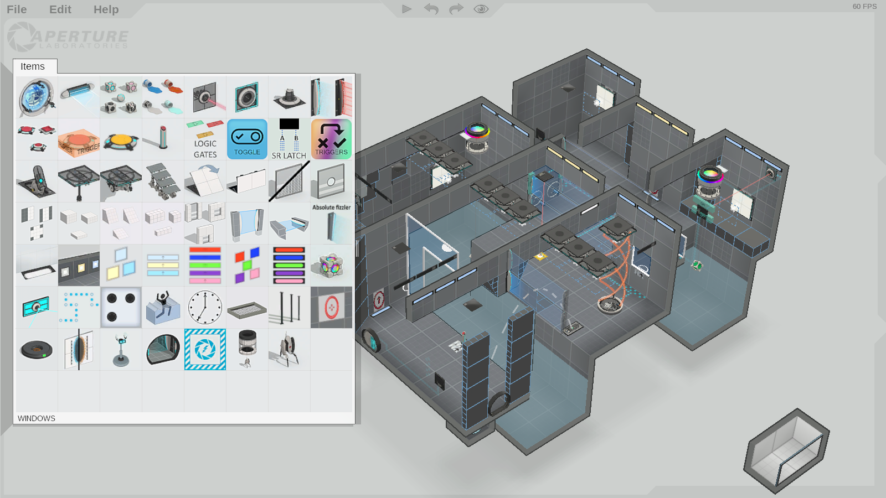

In 2012 Valve Software released the Perpetual Testing Initiative (or PeTI)
update for Portal 2, which added an in-game level editor that allows anyone to
easily create their own puzzles and share them via the Steam Workshop.

BEEmod, the "Better Extended Editor," is a modification that, if you can believe
it, extends this in-game editor. For the purposes of this post, its most
important feature is the ability to add custom items. BEEmod's main interface is
an external program where the user can configure various options and select
which items they would like to use, then export their changes to the game. It
does not change any of the editor's code, so some hard-coded limitations, such
as the size of the palette where items are found, are still in effect.

The palette only has 32 slots, and they can fill up quickly. It's not uncommon
to have to exit the game, switch out some items in your palette from the BEEmod
interface, export your changes, and start the game back up several times during
the course of puzzle creation.

This is really annoying, so let's patch it.

## asdklfjaweiofsa

We'll target the Windows version of Portal 2 because it is likely the most
commonly used and it also runs very well in
[Proton](https://en.wikipedia.org/wiki/Proton_(software)). This is good news for
Linux users, because (at least at the time of writing) the in-game editor is
broken in the native Linux build.

On Windows, the relevant code is in `Portal 2/portal2/bin/client.dll`. This file
is somewhat large and has been stripped of debug information. However, the
[steamdb page](https://steamdb.info/depot/623/) for the macOS-specific content
lists an interesting file: `puzzlemaker_dll.dylib`.

We can download this macOS content, regardless of the platform Steam is
currently running on, with the `download_depot <appid> <depotid>` command in the
Steam console. The console can be opened by navigating to
[`steam://open/console`](steam://open/console) in your browser, or by launching
Steam with the `-console` command line flag. As steamdb shows us, Portal 2's app
ID is 620, and the depot ID for the macOS content is 623, so the full command is
`download_depot 620 623`.

The palette is represented by the `CEditorUIPalette` class. It has three member
functions of particular interest, shown in this approximation of how the
original C++ code may have looked:

```cpp
class CEditorUIPalette : public CEditorUIPanel {
public:
    void LoadResources() override;
    void Render() override;
    // [...]
    void UpdateSize(int width, int height) override;
    // [...]
};
```

Thirty-two buttons are created in `LoadResources`, accounting for the 4x8 grid
of items in the palette.

```cpp
void CEditorUIPalette::LoadResources() {
    CQP2EditorViewport *viewport = GetViewport();
    unsigned int blankTexture = viewport->LoadOpenGLTexture(&BLANK_IMAGE);

    for(int i = 0; i < 32; i++) {
        CEditorUIPanel *button = g_pUIManager->CreateUIDraggableButton();
        button->SetTexture(blankTexture);
        button->SetEnabled(false);
        m_buttons.AddToTail(button);
    }

    // [...]
}
```

In `UpdateSize`, the buttons are sized based on the resolution of the
screen/window and positioned in the grid.

```cpp
void CEditorUIPalette::UpdateSize(int width, int height) {
    m_buttonSize = height / 12;
    int leftBarWidth = height / 80;
    int sidebarWidth = Max(leftBarWidth, 10);

    SetPos(0, 0);

    m_mainAreaX = sidebarWidth + leftBarWidth;

    int textWidth, textHeight;
    m_itemNameLabel->GetTextSize(&textWidth, &textHeight);
    m_mainAreaHeight = textHeight + 18 + m_buttonSize * 8;

    int y = height / 2 - m_mainAreaHeight / 2;
    m_mainAreaY = y;

    m_mainAreaWidth = m_buttonSize * 4 + 14;
    y += 5;

    int n = 0;
    for(int row = 0; row < 8; row++) {
        x = m_mainAreaX + 6;
        for(int col = 0; col < 4; col++) {
            m_buttons[n]->SetSize(m_buttonSize, m_buttonSize);
            m_buttons[n]->SetPos(x, y);
            n++;
            x += m_buttonSize + 1;
        }
        y += m_buttonSize + 1;
    }

    // [...]
}
```

## Bla

Drawing the buttons and text is handled further up in the UI system, but the
rest of the palette is drawn in `Render`. Capturing a frame in RenderDoc or
another similar tool can provide a high-level overview of each step of the
process.

<figure>
  <div style="display: flex; align-items: center">
  <button onclick="prev()">⮜</button>
  
  <button onclick="next()">➤</button>
  </div>
  <figcaption>The steps of <code>CEditorUIPalette::Render</code></figcaption>
</figure>

<script>
  const img = document.querySelector("#steps");
  let n = 0;

  function prev() {
    n = (n - 1 + 31) % 31;
    img.src = `steps/${n + 1}.png`;
  }

  function next() {
    n = (n + 1) % 31;
    img.src = `steps/${n + 1}.png`;
  }
</script>

Matching up the code with the observed drawing order points to

```cpp
void CEditorUIPalette::Render() {
    // [...]

    viewport->Draw2DQuadFilled(
        m_mainAreaX, m_mainAreaY,
        m_mainAreaVisibleWidth, m_mainAreaHeight,
        color
    );

    // [...]
}
```

`m_mainAreaVisibleWidth` is set in `FrameUpdate` and changes as the palette
opens and closes, but it is derived from the fully-opened width
`m_mainAreaWidth`, which itself is set in `UpdateSize` to be the width of the
four buttons plus a fixed amount of padding.

```cpp
void CEditorUIPalette::UpdateSize(int width, int height) {
    // [...]

    m_mainAreaWidth = m_buttonSize * 4 + 14;

    // [...]
}
```

If there are `n` buttons in a row, there are `n - 1` spaces between them to be
padded by `INNER_PADDING` and two outer edges to be padded by `OUTER_PADDING`.
That is,

```cpp
m_mainAreaWidth =
    m_buttonSize * n
    + INNER_PADDING * (n - 1)
    + OUTER_PADDING * 2;
```

Counting pixels shows that `OUTER_PADDING` is 5 and `INNER_PADDING` is 1. Since
`n` is 4, there should be 13 pixels of padding in total. So why is the code
adding 14?

As it turns out, the left border is drawn overlapping the white backround while
the right border is drawn one pixel to the right of it, so in the end there are
actually only `m_mainAreaWidth - 1` white pixels per row. Adjusting for this
yields

```cpp
m_mainAreaWidth =
    m_buttonSize * n
    + INNER_PADDING * (n - 1)
    + OUTER_PADDING * 2
    + 1;
```

## What to patch

To double the width of the palette there are three functions that need to be
patched.

### CEditorUIPalette::LoadResources

Buttons for the palette items are created in a loop. The loop variable can be
changed to count down from 64 instead of 32.

```diff
- c7 45 f4 20 00 00 00    mov [ebp - 0xc], 32
+ c7 45 f4 40 00 00 00    mov [ebp - 0xc], 64
```

The items are then iterated over to initialize their corresponding buttons. The
button to initialize is chosen based on the item's position on the grid.

```cpp
m_buttons[position.x + position.y * 4 + position.z]
```

(It's not clear why z is involved here at all, but it seems to always be zero.)

We double the width from 4 to 8.

```diff
- 8d 04 91                lea eax, [ecx + edx*4]
+ 8d 04 d1                lea eax, [ecx + edx*8]
```

### CEditorUIPalette::UpdateSize

The positions and sizes of the buttons are set in a nested loop.

```cpp
int n = 0;
for(int row = 0; row < 8; row++) {
    x = m_mainAreaX + 6;
    for(int col = 0; col < 4; col++) {
        m_buttons[n]->SetSize(m_buttonSize, m_buttonSize);
        m_buttons[n]->SetPos(x, y);
        n++;
        x += m_buttonSize + 1;
    }
    y += m_buttonSize + 1;
}
```

We can bump the number of columns from 4 to 8.

```diff
- c7 45 f0 04 00 00 00    mov [ebp - 0x10], 4
+ c7 45 f0 08 00 00 00    mov [ebp - 0x10], 8
```

That takes care of the buttons, but the size of the white background area behind
them also needs to be extended, since, in addition to being ugly, leaving it at
the old width causes the palette to close when the mouse is moved outside.

```cpp
m_mainAreaWidth = m_buttonSize * 4 + 14;
```

That is, the width of four buttons, five pixels of padding on each edge, and one
pixel of spacing to the left of each button.

(The extra pixel of spacing on the left column of buttons is cancelled by the
fact that the black border on the left is drawn overlapping the white area
while the right border is not. This is also why the buttons were positioned
starting at `m_mainAreaX + 6` instead of `m_mainAreaX + 5`.)

Since we're adding four more buttons to each row, that's four more
`m_buttonSize`s and four more pixels of spacing.

```diff
- 8d 14 bd 0e 00 00 00    lea edx, [edi*4 + 14]
+ 8d 14 fd 12 00 00 00    lea edx, [edi*8 + 18]
```

### CEditorUIPalette::Render

The final change is purely cosmetic: there is a grid drawn between the buttons
and it needs four more vertical lines.

```diff
- c7 45 e4 03 00 00 00    mov [ebp - 0x1c], 3
+ c7 45 e4 07 00 00 00    mov [ebp - 0x1c], 7
```

## Where to patch

The puzzle maker component of Portal 2 does not generally receive substantial
updates, so things like the offsets of structure fields and even the compiled
code itself are unlikely to change. However, there is more to `client.dll` than
the puzzle maker, so the location of the code we want to patch can and often
does change.

Conveniently, the functions we need to patch are all virtual functions in
`CEditorUIPalette`. This means that they will all be stored in a table and, at
least in the case of Microsoft's Visual C++ compiler, in the same order as their
declaration in the source code, which is also unlikely to change.

The virtual function table can be located by exploiting the presence of
[run-time type information](https://en.wikipedia.org/wiki/Run-time_type_information)
(RTTI) in `client.dll`, in particular as implemented in Visual C++ and described
[here](https://blog.quarkslab.com/visual-c-rtti-inspection.html).

## How to patch

The following Python script uses RTTI to find `CEditorUIPalette`'s virtual
function table, looks up the functions to be patched at fixed offsets in the
table, and patches the binary at fixed offsets from the beginnings of those
functions. The last step in particular is not very robust, and it would probably
be a good idea to at least do some basic pattern matching to find the
instructions to patch. That said, I've been using essentially this exact script
for over a year without issues, so improving it is left as an exercise for the
reader.

<h3 style="color: red">
I am not responsible for any fucking up of your computer
or life caused by the use of this script.
</h3>

```python
import pefile

client_dll_path = "C:\\Program Files (x86)\\Steam\\steamapps\\common\\Portal 2\\portal2\\bin\\client.dll"

pe = pefile.PE(client_dll_path)
image = pe.get_memory_mapped_image(ImageBase=0)

def find_vftable(image, cls):
    type_descriptor = image.find(cls) - 8
    complete_object_locator = image.find(type_descriptor.to_bytes(4, "little")) - 0xC
    vftable = image.find(complete_object_locator.to_bytes(4, "little")) + 4
    return vftable


def get_vfunc_file_offset(vtable, n):
    return pe.get_offset_from_rva(pe.get_dword_at_rva(vtable + n * 4) - 0x10000000)


CEditorUIPalette_vftable = find_vftable(image, b".?AVCEditorUIPalette@@")
LoadResources = get_vfunc_file_offset(CEditorUIPalette_vftable, 0)
Render = get_vfunc_file_offset(CEditorUIPalette_vftable, 1)
UpdateSize = get_vfunc_file_offset(CEditorUIPalette_vftable, 4)

pe.close()

with open(client_dll_path, "r+b") as f:
    #
    # CEditorUIPalette::LoadResources
    #

    # number of buttons
    # - mov [ebp - 0xc], 32
    # + mov [ebp - 0xc], 64
    f.seek(LoadResources + 0x22 + 3)
    f.write(b"\x40")

    # number of columns for indexing
    # - lea eax, [ecx + edx*4]
    # + lea eax, [ecx + edx*8]
    f.seek(LoadResources + 0x13A + 2)
    f.write(b"\xd1")

    #
    # CEditorUIPalette::UpdateSize
    #

    # number of columns and padding for panel width calculation
    # - lea edx, [edi*4 + 0xe]
    # + lea edx, [edi*8 + 0x12]
    f.seek(UpdateSize + 0xA0 + 2)
    f.write(b"\xfd\x12")

    # number of columns for button placement
    # - mov [ebp - 0x10], 4
    # + mov [ebp - 0x10], 8
    f.seek(UpdateSize + 0xD3 + 3)
    f.write(b"\x08")

    #
    # CEditorUIPalette::Render
    #

    # number of vertical grid lines to draw
    # - mov [ebp - 0x1c], 3
    # + mov [ebp - 0x1c], 7
    f.seek(Render + 0x3B2 + 3)
    f.write(b"\x07")
```
